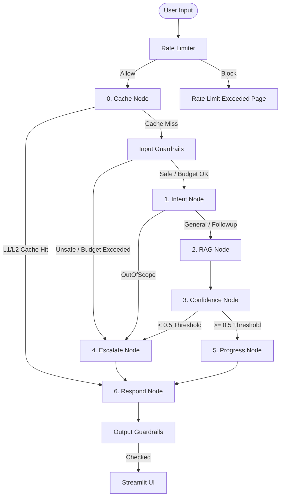
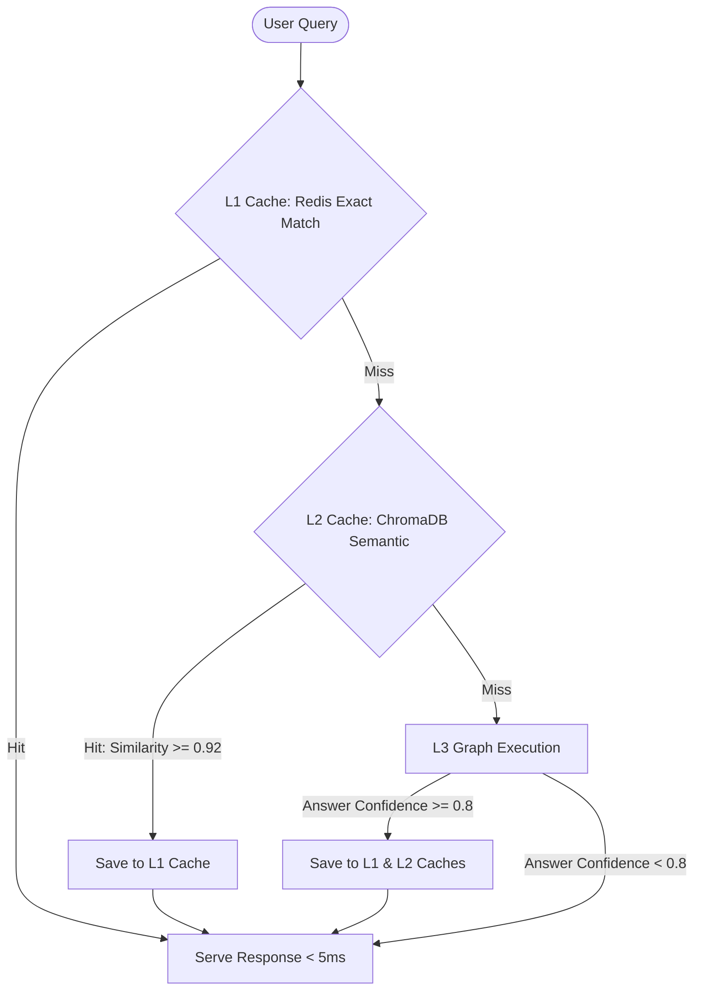
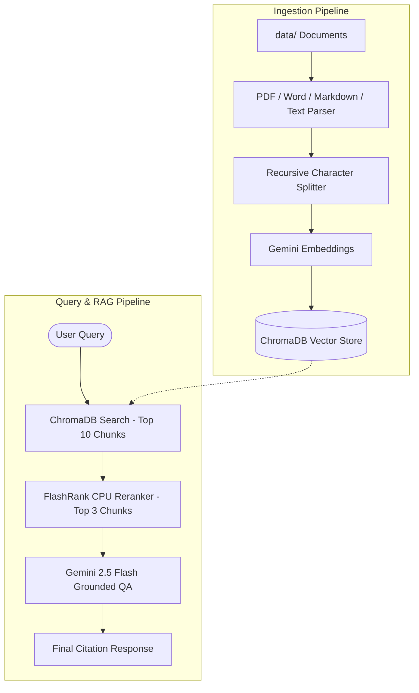
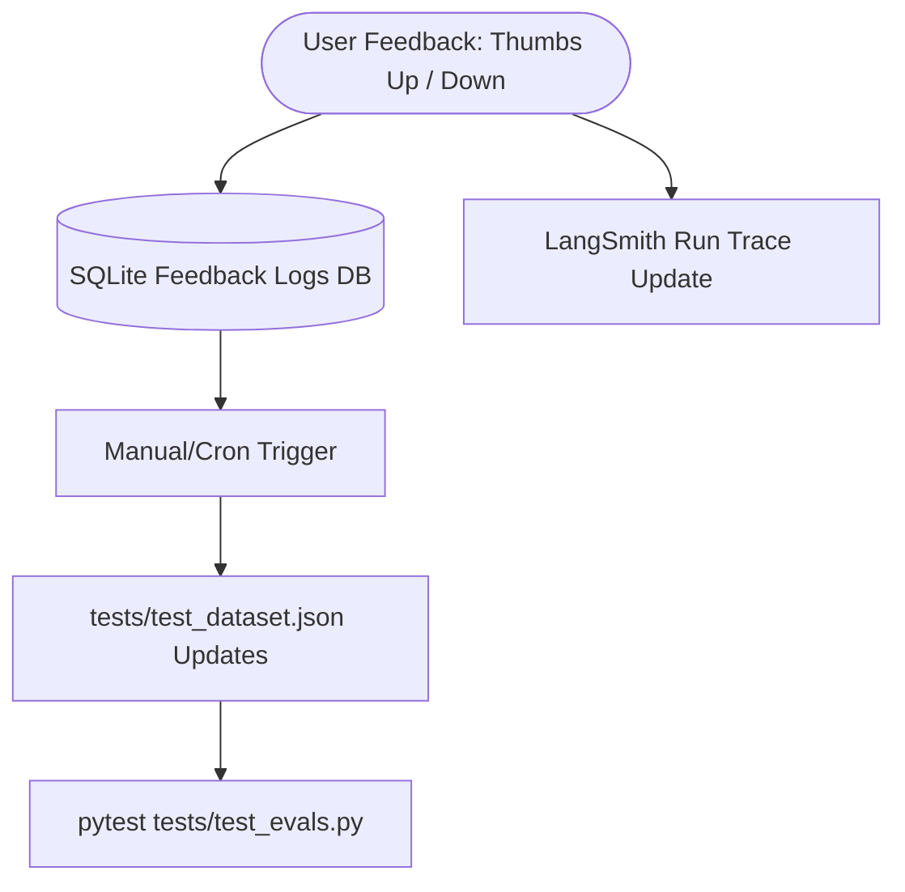

# 🤖 Corporate Onboarding Assistant V2

Corporate Onboarding Assistant V2 is a stateful, multi-turn RAG chatbot guiding new hires through IT setup, leave policies, health insurance, and payroll.

---

## 🏗️ Architectural Flow

The request lifecycle is managed as a compiled state machine under **LangGraph**, ensuring memory persistence and context routing:



---

## ⚡ Hybrid Caching Strategy

The assistant implements L1/L2 cache layers to reduce token costs and minimize response latency:



---

## 📚 Document Ingestion & RAG Pipeline

Documents are parsed, chunked, and embedded on-demand, then reranked during query retrieval:



---

## 🔄 User Feedback Flywheel

Flags and ratings populate local feedback datastores and update automated test suites:



---

## 📂 Quick Reference Folder Structure

*   `app.py`: Streamlit frontend UI.
*   `graph/`: Graph orchestration (`state.py`, `nodes.py`, `edges.py`, `graph.py`).
*   `rag/`: Document parsers and rerankers (`ingest.py`, `retriever.py`).
*   `utils/`: Caching (`cache.py`), startup checker (`config_check.py`), rate-limiter (`rate_limiter.py`).
*   `guardrails/`: Safety PII and prompt injection filters (`guard.py`).
*   `tests/`: DeepEval automated RAG evaluations (`test_evals.py`).
*   `agents/`: Automated code static compliance auditor (`auditor.py`).

---

## 🚀 Quick Run Guide

### 1. Configure Environment
Create a `.env` in the root folder:
```ini
GOOGLE_API_KEY=YOUR_GEMINI_API_KEY
REDIS_URL=redis://localhost:6379/0
SESSION_BUDGET_USD=0.50
```

### 2. Start Services
Run Redis and install requirements:
```powershell
# 1. Activate Environment & Install requirements
.venv\Scripts\Activate.ps1
pip install -r requirements.txt

# 2. Run Redis Container
docker run -d --name local-redis -p 6379:6379 redis:7.2-alpine
```

### 3. Ingest Data & Launch Chat UI
```powershell
# 1. Ingest Raw Documents (from /data directory)
python rag/ingest.py

# 2. Launch Streamlit Chat Client
streamlit run app.py
```

---

## 🧪 Admin Compliance & Testing CLI Commands

| Action | Command | Expected Result |
| :--- | :--- | :--- |
| **Code Auditor** | `python agents/auditor.py` | Generates a static guidelines validation report `audit_report.json`. |
| **RAG Eval Tests** | `pytest tests/test_evals.py` | Executes DeepEval metrics (Faithfulness & Relevance) against benchmarks. |
| **GDPR PII Purge** | `python utils/purge_user.py <session_id>` | Deletes all checkpoints and logs matching a target session ID. |
| **30-Day Cleanup** | `python utils/prune_db.py` | Automatically wipes SQLite checkpoints older than 30 days. |
