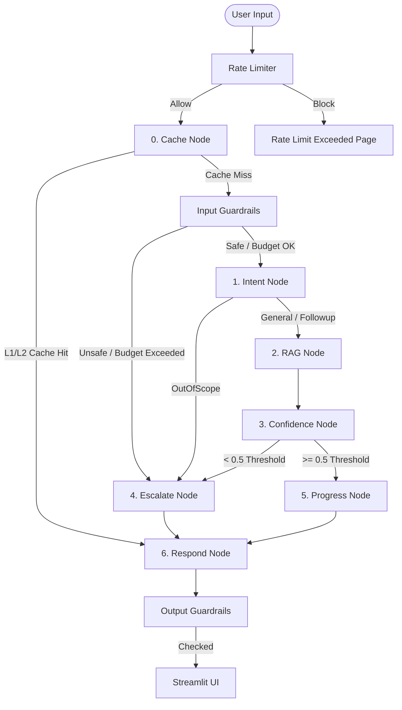

# Corporate Onboarding Assistant V2 — Codebase Context & Architecture

This document serves as a comprehensive developer reference and context guide for the **Corporate Onboarding Assistant V2** application. It details the file structure, core design patterns, component responsibilities, and operational workflows.

---

## 📂 File & Directory Hierarchy

The codebase is organized into modular components separating the UI, orchestration graph, document retrieval (RAG), security guardrails, utilities, testing, and static analysis:

```text
Corporate Onboarding Assistant V2/
│
├── app.py                     # Main Streamlit web application & UI theme layout
├── requirements.txt           # Package dependencies
├── Dockerfile                 # Container packaging config
├── docker-compose.yml         # Container services composer (Redis runtime)
│
├── graph/                     # LangGraph State Machine
│   ├── state.py               # Shared AgentState TypedDict definition
│   ├── graph.py               # Assembles nodes/edges into the compiled StateGraph
│   ├── nodes.py               # Individual step functions (caching, intent, RAG, escalate, etc.)
│   └── edges.py               # Conditional routing logic functions
│
├── rag/                       # Document Retrieval & Ingestion Pipeline
│   ├── ingest.py              # Script to parse and vectorise PDF, Word, MD, and Text files
│   └── retriever.py           # Retrieves from ChromaDB, reranks using FlashRank, fallback to offline
│
├── guardrails/                # Content Safety & Threat Prevention
│   └── guard.py               # Input/output safety filters (PII, injections, toxicity, budget)
│
├── utils/                     # Cache, Rate Limiting, Feedback, & GDPR
│   ├── cache.py               # Two-Tier Cache (L1 Redis exact match / L2 ChromaDB semantic match)
│   ├── rate_limiter.py        # Redis-based fixed-window session rate limiter
│   ├── feedback.py            # SQLite log storage & LangSmith trace annotation sync
│   ├── progress.py            # Regex-based onboarding checklist updater
│   ├── purge_user.py          # GDPR compliance script to wipe specific session IDs
│   ├── prune_db.py            # Scheduled DB maintenance script (30-day retention)
│   ├── logger_config.py       # Centrally configured logging standards
│   └── config_check.py        # Startup fast-fail verification script
│
├── tests/                     # Automated QA & Evaluations
│   ├── test_evals.py          # DeepEval testing (faithfulness and answer relevance)
│   └── test_dataset.json      # Dynamic benchmark test cases
│
├── agents/                    # Codebase Quality Assurance
│   └── auditor.py             # LLM-based static compliance and rules auditor
│
└── styles/                    # User Interface Aesthetics
    └── aurora_theme.css       # Custom glassmorphism Aurora theme styling
```

---

## 🏗️ Core Architectural Workflows

### 1. Request Lifecycle State Machine (LangGraph)
All user queries entering the system pass through a compiled state graph (`StateGraph`) with a persistent `SqliteSaver` checkpointer. 



---

## 🔧 Component Details

### A. Graph Orchestration
* **`graph/state.py`**: Declares `AgentState` containing critical parameters:
  * `session_id`: Unique user session trace ID.
  * `user_role`: Active persona (`joinee`, `manager`, `HR`) to filter response priorities.
  * `conversation_history`: Maintained up to the last 10 messages (older messages are compressed in `respond_node`).
  * `token_usage` & `total_cost_usd`: Session usage tracking.
* **`graph/nodes.py`**:
  * `cache_node`: Checks the hybrid cache first.
  * `intent_node`: Classifies inputs into `General`, `Followup`, or `OutOfScope` using Gemini 2.5 Flash.
  * `rag_node`: Triggers document retrievers and builds grounded responses.
  * `confidence_node`: Evaluates confidence scores.
  * `escalate_node`: Synthesizes ticket details to send to HR when questions cannot be answered.
  * `progress_node`: Evaluates regex keyword checks to tick off completed onboarding checklist items.
  * `respond_node`: Compresses context history, handles cleanups, and seeds the cache with high-confidence responses.
* **`graph/edges.py`**: Routing logic based on L1/L2 hits, intent classifications, and confidence thresholds.

### B. Hybrid Caching Strategy (`utils/cache.py`)
To optimize performance and minimize API token billing, the application implements a sequential two-tier caching mechanism:
1. **L1 (Redis Exact Match)**: Normalizes the input query (strips whitespace, lowercase) and hashes it using SHA-256 to perform a fast exact lookup (TTL: 24 hours).
2. **L2 (ChromaDB Semantic Match)**: If L1 misses, queries a vector collection (`onboarding_semantic_cache`) using `gemini-embedding-001`. A cosine similarity score $\ge 0.92$ triggers a semantic hit.
3. **Propagation**: On an L2 cache hit, the result is saved back to L1 Redis to ensure subsequent matching requests resolve in $<5$ms. High-confidence graph responses (confidence $\ge 0.8$) are added to both L1 and L2 caches.

### C. Grounded Retrieval (RAG) & Fallback (`rag/retriever.py`)
1. **Semantic Fetching**: Queries the document vector collection, returning the top 10 relevant document chunks.
2. **FlashRank Reranking**: Utilizes a local, lightweight CPU reranker model (`FlashRank`) to narrow the top 10 chunks down to the top 3 high-relevance chunks.
3. **Resilient Local Fallback**: If ChromaDB or the embedding service fails, the system executes `fallback_local_retrieval` by executing keyword scanning over a local flat file (`onboarding_faq.txt`), returning matched paragraphs ranked by word overlap and setting a `degraded` flag to warn the user in the UI.

### D. Input/Output Safety Guardrails (`guardrails/guard.py`)
* **`validate_input`**: Performs checks before LLM invocation:
  * *Budget limit*: Blocks queries if the cumulative session cost meets or exceeds `$0.50`.
  * *Prompt Injection*: Blocks queries containing prompt override phrases.
  * *Toxicity*: Filters queries using explicit blacklist matching.
  * *PII Leakage*: Redacts or blocks queries containing credit card numbers, email templates, phone numbers, or credentials.
* **`validate_output`**: Inspects outputs before displaying them to the user:
  * *API Key leak*: Uses regex to detect and block exposure of internal credentials/API keys.
  * *Grounding check*: Appends a general fallback warning if the model answers factual inquiries without matching source documents.

### E. MLOps, Quality Testing, & Compliance Tools
* **`utils/feedback.py`**: Thumbs-up/down ratings store interactions inside `feedback_history.db` and annotate active **LangSmith** tracing runs. Queries marked with a thumbs-down are automatically appended as new regression test cases in `tests/test_dataset.json`.
* **`tests/test_evals.py`**: Executes automated quality unit tests using **DeepEval**, evaluating RAG pipelines for *Faithfulness* and *Answer Relevancy* using custom Gemini models.
* **`utils/purge_user.py`**: CLI script providing GDPR "Right to be Forgotten" capability, erasing all session IDs and related checkpoints from the SQLite database.
* **`utils/prune_db.py`**: Automatically cleans up conversation histories and feedback logs older than 30 days.
* **`agents/auditor.py`**: An automated static analysis agent that verifies codebase compliance against strict design guidelines (e.g., ensuring `confidence_node` and `progress_node` remain pure Python, verifying prompt isolation in `prompts.py`, and checking try-catch blocks on API nodes).

---

## 🛠️ CLI Operations Reference

| Operation | Command | Purpose |
| :--- | :--- | :--- |
| **Run Ingestion** | `python rag/ingest.py` | Parses `data/` files and populates ChromaDB |
| **Start Web App** | `streamlit run app.py` | Launches custom Aurora UI |
| **Static Audit** | `python agents/auditor.py` | Performs AI-driven codebase audits |
| **RAG Eval Tests** | `pytest tests/test_evals.py` | Executes DeepEval metrics (Faithfulness & Relevance) |
| **GDPR PII Purge** | `python utils/purge_user.py <session_id>` | Wipes specific user sessions |
| **DB Pruner** | `python utils/prune_db.py` | Deletes logs/checkpoints older than 30 days |

---

## 🛡️ Recent Production Hardening Changes

The codebase has been refactored to resolve critical, high, and medium severity security vulnerabilities and optimize API search latency:

1. **Secrets & Git Cleanup**: Untracked `.env` from Git, added `auth_config.yaml` to `.gitignore` to keep credentials private, and created `.dockerignore` to block local databases, cache files, and private environment files from building into Docker images.
2. **User Authentication**: Integrated `streamlit-authenticator` using bcrypt-hashed logins inside [auth_config.yaml](file:///d:/SR/Main%20Projects/Corporate%20Onboarding%20Assistant%20V2/auth_config.yaml) to gate application entry and establish role-based scopes. Loaded cookie signature keys from the environment to prevent key exposure.
3. **Database Concurrency**: Fixed SQLite thread-safety inside `graph/graph.py` by converting to `SqliteSaver.from_conn_string(db_path)` for thread-isolated SQLite connections.
4. **ChromaDB Client Singleton**: Unified client initialization by creating a shared client singleton in [utils/chroma_manager.py](file:///d:/SR/Main%20Projects/Corporate%20Onboarding%20Assistant%20V2/utils/chroma_manager.py) to prevent database locks and race conditions.
5. **Privilege-Isolated Cache**: Partitioned L1 (Redis) exact match keys and L2 (ChromaDB) semantic cache entries by `user_role` in `utils/cache.py` to prevent lower-privileged users from reading cached responses generated for administrative roles.
6. **Role-Gated RAG retrieval**: Added metadata tagging during document ingestion (`ingest.py`) to assign `required_role` levels to document chunks. Added authorization logic in `retriever.py` to restrict document search results based on the active role of the querying user.
7. **Single-Embedding Execution**: Optimized query performance by saving the calculated query embedding vector in the shared LangGraph `AgentState` in `graph/state.py`. Reused this precomputed vector across cache lookups and RAG searches, cutting cache-miss latency by ~200–500ms and reducing embedding API billing by **50%**.
8. **Guardrails & Normalization**: Hardened input guardrails against homoglyph and accent-based bypasses by introducing NFKC Unicode normalization and diacritics removal before scanning.
9. **Smart History Compression**: Upgraded naive conversation history truncation to LLM-powered context summarization of older history, keeping the last 4 turns intact.
10. **Rate Limiting & Cost Checking**: Active session rate-limiting and maximum character constraints (2,000 characters) were integrated into the message loop in `app.py`.
11. **Operational Alerting**: Added structured critical alert logs `ALERT:HR_ESCALATION` in the graph nodes to replace fake front-end notifications.
12. **Rigorous Offline Testing**: Added a local unit test suite of 23 tests under `tests/` (including guardrails, progress tracking, routing, rate limiter mock cases, cache partition, and authorized retrieval query tests) passing in $<0.3$ seconds.
13. **Authentication Initialization**: Solved modern `streamlit-authenticator` 0.3.0+ compatibility issue in [app.py](file:///d:/SR/Main%20Projects/Corporate%20Onboarding%20Assistant%20V2/app.py) by reading `name`, `authentication_status`, and `username` directly from `st.session_state` instead of trying to unpack the `login()` return value (which returns `None` when rendered in `'main'`).
14. **SQLite Checkpointer Thread Safety**: Resolved a `TypeError` when compiling the LangGraph workflow with context manager-based checkpointers. Replaced `SqliteSaver.from_conn_string` with direct creation using a connection object (`SqliteSaver(sqlite3.connect(..., check_same_thread=False))`), preserving active connections across concurrent Streamlit session runs and test executions.


